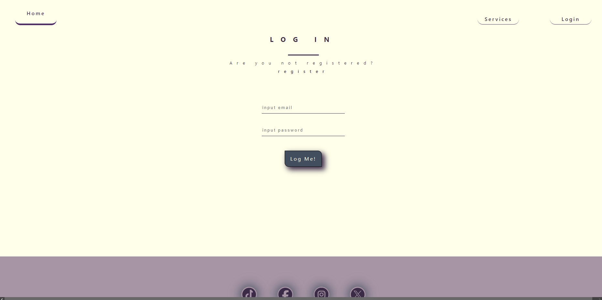

# Tattoo's Studio📢


<details>
  <summary>Content 📝</summary>
  <ol>
    <li><a href="#objective">Objective</a></li>
    <li><a href="#about-the-project">About the project</a></li>
    <li><a href="#Local-installation">Installation</a></li>
    <li><a href="#stack">Technologies used</a></li>
    <li><a href="#Views">Views</a></li>
    <li><a href="#contributions">contributions</a></li>
    <li><a href="#contact">Contact</a></li>
  </ol>
</details>

## Objective 🎯
This project's objectives consists in creating a frontend of an Tattoo's Studio API, also created by me ([Tattoo's Studio repository](https://github.com/JesusMatinezClavel/GeeksHub_FourthAssignment_TattooShop.git)) with vite/react technology.

## About the project📑
This aplication has been created as an assignment for the GeeksHub's FullStackDeveloper bootcamp with the objective of developing a frontend with vite and react technologies using the Tattoo Studio's API [Tattoo's Studio repository](https://github.com/JesusMatinezClavel/GeeksHub_FourthAssignment_TattooShop.git), also creating the connections necessary to register, log in, and create and see appointments. It also has an option for the superadmin to view all users and delete each one.

## Technologies used 💻
<div align="center">

<a href="https://reactjs.org/">
    
</a>
<a href="https://nextjs.org/">
    
</a>
<a href="https://developer.mozilla.org/es/docs/Web/JavaScript">
    
</a>
<a href="https://git-scm.com/">
    
</a>
<a href="https://www.github.com/">
    
</a>
 </div>

## Local installation🔨
1. Clone the repository:

    `$ git clone https://github.com/JesusMatinezClavel/GeeksHub_SixthAssignment_TattoStudio-s_FrontEnd.git`

2. Install the dependencies

    ` $ npm install `

3. Run the website:

   ` $ npm run dev `

## Deployment
<div align="center">

[Tattoo Studio's Deployment](https://master.danywws95pvcr.amplifyapp.com/)

 </div>


## Views 👁
### Home 🖐🏼


### Services 🤲🏼


### Register ✍🏼


### Log In 👍🏼




### Appointments Empty 🙏🏼


### Appointments 💪🏼


### Superadmin Empty ♟


### Superadmin All Users ♛


## Contributions🤘
Sugestions are always welcomed!

You can do it both ways:

1. Create an issue
2. Create a fork of the repository
    - Create new branch
        ```
        $ git checkout -b feature/nombreUsuario-mejora
        ```
    - Commit the changes
        ```
        $ git commit -m 'feat: mejora X cosa'
        ```
    - Push the branch
        ```
        $ git push origin feature/nombreUsuario-mejora
        ```
    - Open a Pull Request

## Contact📧
<a href = "mailto:jmcvalles@gmail.com"></a>
<a href="https://www.linkedin.com/in/jes%C3%BAs-mart%C3%ADnez-clavel-vall%C3%A9s-913294108?lipi=urn%3Ali%3Apage%3Ad_flagship3_profile_view_base_contact_details%3BtQmk%2FVrTShiKcofYcK6uYg%3D%3D" target="_blank"></a> 
<a href="https://github.com/JesusMatinezClavel" target="_blank">    </a> 
</p>

